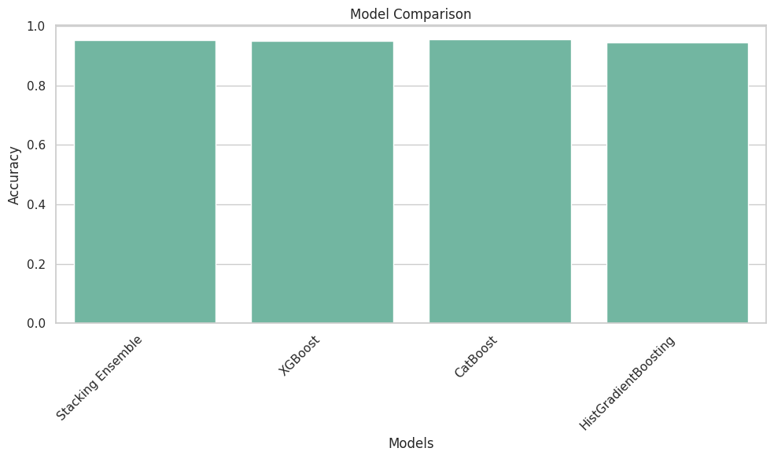

---

# **Exploring Mental Health Data - Depression Prediction**

## **Project Overview** 📊

This project focuses on predicting mental health status (Depression) using a dataset generated from a deep learning model trained on the Depression Survey. We explore various machine learning models like XGBoost, CatBoost, and HistGradientBoosting, perform hyperparameter tuning, and evaluate the results with multiple metrics such as accuracy, precision, recall, F1-score, and AUC-ROC.

## **Table of Contents** 📋

1. [Introduction](#introduction)
2. [Data Description](#data-description)
3. [Exploratory Data Analysis (EDA)](#exploratory-data-analysis-eda)
4. [Data Preprocessing](#data-preprocessing)
5. [Modeling](#modeling)
6. [Results](#results)
7. [Conclusion](#conclusion)
8. [Dependencies](#dependencies)
9. [License](#license)

## **Introduction** 💡

This project aims to predict the depression status (`Depression`) based on various personal and academic features like `Age`, `CGPA`, `Work Pressure`, `Sleep Duration`, etc. We use an ensemble of machine learning models to achieve high predictive accuracy and explore different techniques to optimize and evaluate the model.

## **Data Description** 🧑‍💻

The dataset contains multiple features related to academic and work pressures, along with a binary target class (`Depression`), which indicates whether a person is experiencing depression.

- **Train.csv**: The training dataset containing input features and target labels.
- **Test.csv**: The test dataset containing input features for prediction.
- **Sample_submission.csv**: A template for submitting predictions.

## **Exploratory Data Analysis (EDA)** 🔍

In this section, we perform exploratory analysis to understand the distribution of the data, handle missing values, visualize the relationships between different features, and understand the target variable. Key findings:
- Data distribution for categorical and continuous variables.
- Missing values handling and feature engineering.

## **Data Preprocessing** 🛠️

Data preprocessing steps involve:
- Handling missing values (imputation or removal).
- Encoding categorical variables.
- Normalizing or scaling numerical features where necessary.
- Splitting the data into training and validation sets.

## **Modeling** 🤖

We implement the following models:
- **XGBoost**: A gradient boosting framework optimized for performance.
- **CatBoost**: A boosting algorithm that handles categorical data well.
- **HistGradientBoosting**: A faster implementation of gradient boosting.
  
We also tune hyperparameters using grid search or random search to optimize performance.

## **Results** 📈

After training and evaluating the models, the performance results are as follows:

- **Ensemble**:
    - Accuracy: 95.37%
    - Precision: 87.66%
    - Recall: 85.62%
    - F1-Score: 86.63%
    - AUC-ROC: 0.9831
- **XGBoost**:
    - Accuracy: 94.96%
    - Precision: 86.56%
    - Recall: 84.37%
    - F1-Score: 85.45%
    - AUC-ROC: 0.9821
- **CatBoost**:
    - Accuracy: 95.46%
    - Precision: 88.23%
    - Recall: 85.49%
    - F1-Score: 86.84%
    - AUC-ROC: 0.9839
- **HistGradientBoosting**:
    - Accuracy: 94.58%
    - Precision: 85.45%
    - Recall: 83.26%
    - F1-Score: 84.34%
    - AUC-ROC: 0.9799



## **Conclusion** 🏁

The ensemble model combining XGBoost, CatBoost, and HistGradientBoosting yields the best results, achieving over 95% accuracy and a high AUC-ROC score. The approach can be extended to more complex models or feature engineering strategies for further improvement.


## **Dependencies** 📦

Ensure you have the following Python packages installed:
- `xgboost`
- `catboost`
- `scikit-learn`
- `pandas`
- `numpy`
- `matplotlib`
- `seaborn`

You can install them using:
```bash
pip install xgboost catboost scikit-learn pandas numpy matplotlib seaborn
```

## **License** 📄

This project is licensed under the [MIT License](LICENSE).

---
